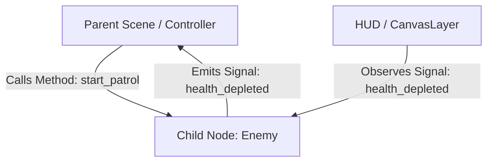

# Godot 4 Design Patterns: The Game Architecture Manual

This guide provides architectural and game programming design patterns designed specifically for the **Godot 4 Engine**.

Godot differs fundamentally from traditional component-based engines (like Unity) or pure code-driven frameworks:
- **The SceneTree IS the Architecture**: Every entity, UI component, audio source, and level chunk is a `Node` inside a hierarchical tree.
- **Scenes are Prototypes**: Every `.tscn` file is a reusable, composable blueprint that can be nested, inherited, or dynamically instantiated.
- **Signals are First-Class Observers**: Loose coupling is built directly into the engine's core object model.
- **Resources are Flyweights & Strategies**: Data and behavior definitions are shared across instances without duplicating memory.

---

## Table of Contents
<table>
  <thead>
    <tr>
      <th align="left">Section</th>
      <th align="left">Description</th>
      <th align="center">Lines</th>
    </tr>
  </thead>
  <tbody>
    <tr>
      <td><a href="#pattern-catalog-quick-reference"><strong>Pattern Catalog Quick Reference</strong></a></td>
      <td><table></td>
      <td align="center"><code>L83–L148</code></td>
    </tr>
    <tr>
      <td><a href="#1-the-core-godot-law-call-down-signal-up"><strong>1. The Core Godot Law: "Call Down, Signal Up"</strong></a></td>
      <td>The single most fundamental architectural rule in Godot:</td>
      <td align="center"><code>L149–L167</code></td>
    </tr>
    <tr>
      <td><a href="#2-scenetree-composition-pattern-entity-component"><strong>2. SceneTree Composition Pattern (Entity-Component)</strong></a></td>
      <td>Rather than deep class inheritance hierarchies (Actor &rarr; LivingActor &rarr; DamagableActor &rarr; Playe...</td>
      <td align="center"><code>L168–L227</code></td>
    </tr>
    <tr>
      <td><a href="#3-custom-resource-as-strategy-data-cards"><strong>3. Custom Resource as Strategy & Data Cards</strong></a></td>
      <td>Godot's Resource class is one of its most powerful features.</td>
      <td align="center"><code>L228–L270</code></td>
    </tr>
    <tr>
      <td><a href="#4-flyweight-pattern-via-shared-resources-multimesh"><strong>4. Flyweight Pattern via Shared Resources & MultiMesh</strong></a></td>
      <td>When rendering tens of thousands of objects (bullets, grass blades, particles, coins), creating individual...</td>
      <td align="center"><code>L271–L306</code></td>
    </tr>
    <tr>
      <td><a href="#5-command-pattern-with-godots-undoredo-singleton"><strong>5. Command Pattern with Godot's `UndoRedo` Singleton</strong></a></td>
      <td>Godot includes an industrial-grade UndoRedo manager designed for level editors, grid turn-based games, and...</td>
      <td align="center"><code>L307–L344</code></td>
    </tr>
    <tr>
      <td><a href="#6-node-based-state-machine-pattern"><strong>6. Node-Based State Machine Pattern</strong></a></td>
      <td>Finite State Machines (FSM) control character movement, AI behaviors, and UI screens.</td>
      <td align="center"><code>L345–L409</code></td>
    </tr>
    <tr>
      <td><a href="#7-scenetree-object-pooling-pattern"><strong>7. SceneTree Object Pooling Pattern</strong></a></td>
      <td>Instantiating packed scenes (instantiate()) and freeing them (queue_free()) creates native memory allocatio...</td>
      <td align="center"><code>L410–L467</code></td>
    </tr>
    <tr>
      <td><a href="#8-direct-subsystem-server-pattern"><strong>8. Direct Subsystem Server Pattern</strong></a></td>
      <td>For maximum throughput (physics simulations, raycasting, sound triggers), Godot exposes lower-level C++ sub...</td>
      <td align="center"><code>L468–L488</code></td>
    </tr>
    <tr>
      <td><a href="#9-common-godot-antipatterns-to-avoid"><strong>9. Common Godot Antipatterns to Avoid</strong></a></td>
      <td><table></td>
      <td align="center"><code>L489–L522</code></td>
    </tr>
  </tbody>
</table>

---

## Pattern Catalog Quick Reference

<table>
  <thead>
    <tr>
      <th align="left">Pattern</th>
      <th align="left">Godot 4 Mechanism</th>
      <th align="left">Primary Gameplay Purpose</th>
    </tr>
  </thead>
  <tbody>
    <tr>
      <td><strong>SceneTree Composition</strong></td>
      <td>Child Component Nodes (<code>Health</code>, <code>Hitbox</code>, <code>Mover</code>)</td>
      <td>Build complex entities without deep inheritance hierarchies</td>
    </tr>
    <tr>
      <td><strong>Call Down, Signal Up</strong></td>
      <td>Direct method calls downward, Signals upward</td>
      <td>Decouple UI and parent scenes from child behaviors</td>
    </tr>
    <tr>
      <td><strong>Resource as Strategy</strong></td>
      <td>Custom <code>Resource</code> scripts (<code>ItemData</code>, <code>Spell</code>)</td>
      <td>Pluggable gameplay abilities, data cards, and inventories</td>
    </tr>
    <tr>
      <td><strong>MultiMesh Flyweight</strong></td>
      <td><code>MultiMeshInstance2D</code> / <code>3D</code>, Shared Resources</td>
      <td>Render thousands of bullets, foliage, or debris at 60+ FPS</td>
    </tr>
    <tr>
      <td><strong>Command &amp; UndoRedo</strong></td>
      <td>Engine <code>UndoRedo</code> singleton, action objects</td>
      <td>In-game level editing, turn-based moves, player rebinds</td>
    </tr>
    <tr>
      <td><strong>Node State Machine</strong></td>
      <td><code>State</code> child nodes under a <code>StateMachine</code> manager</td>
      <td>Predictable character movement, animation, and AI flows</td>
    </tr>
    <tr>
      <td><strong>Autoload Facade / Service</strong></td>
      <td>Global Project Settings Autoload singletons</td>
      <td>Sound manager, scene transition, save/load pipelines</td>
    </tr>
    <tr>
      <td><strong>SceneTree Object Pool</strong></td>
      <td>Deactivation via <code>process_mode = DISABLED</code> &amp; reparenting</td>
      <td>Zero-allocation bullet, particle, and enemy recycling</td>
    </tr>
    <tr>
      <td><strong>Blackboard &amp; Groups</strong></td>
      <td>Node Groups (<code>add_to_group</code>) &amp; Shared Dictionaries</td>
      <td>Behavior trees, spatial awareness, and target selection</td>
    </tr>
    <tr>
      <td><strong>Subsystem Servers</strong></td>
      <td><code>RenderingServer</code>, <code>PhysicsServer3D</code>, <code>AudioServer</code></td>
      <td>Ultra high-performance simulation bypassing SceneTree nodes</td>
    </tr>
  </tbody>
</table>

---

## 1. The Core Godot Law: "Call Down, Signal Up"

The single most fundamental architectural rule in Godot:
- **A parent calls methods directly on its children** (because the parent created, owns, or references them).
- **A child NEVER calls methods directly on its parent**; instead, it **emits a signal**.



### Why This Invariant Matters:
- If a child calls `get_parent().update_score(10)`, the child cannot be tested in isolation, reused in another scene, or moved elsewhere in the tree without crashing with `null` reference errors.
- If the child emits `signal enemy_died(score_val)`, any parent or listening system can connect to it. The child remains 100% autonomous.

---

## 2. SceneTree Composition Pattern (Entity-Component)

Rather than deep class inheritance hierarchies (`Actor` &rarr; `LivingActor` &rarr; `DamagableActor` &rarr; `Player`), Godot excels when composing child nodes as components.

### Structure:
```
Player (CharacterBody2D)
├── Sprite2D
├── CollisionShape2D
├── HealthComponent (Node)
├── HitboxComponent (Area2D)
├── HurtboxComponent (Area2D)
└── MovementController (Node)
```

### Implementing Reusable Components:

```gdscript
# HealthComponent.gd
class_name HealthComponent
extends Node

signal health_changed(current: int, max_health: int)
signal died

@export var max_health: int = 100
var current_health: int

func _ready() -> void:
    current_health = max_health

func damage(amount: int) -> void:
    if current_health <= 0:
        return
    current_health = max(0, current_health - amount)
    health_changed.emit(current_health, max_health)
    if current_health == 0:
        died.emit()

func heal(amount: int) -> void:
    current_health = min(max_health, current_health + amount)
    health_changed.emit(current_health, max_health)
```

```gdscript
# HurtboxComponent.gd
class_name HurtboxComponent
extends Area2D

@export var health_component: HealthComponent

func take_hit(damage_amount: int) -> void:
    if health_component:
        health_component.damage(damage_amount)
```

Any entity—whether a Player, Boss, Breakable Pot, or Wooden Barrel—simply attaches `HealthComponent` and `HurtboxComponent` to immediately gain damage reception, death signals, and health bars.

---

## 3. Custom Resource as Strategy & Data Cards

Godot's `Resource` class is one of its most powerful features. Unlike `Node`, a `Resource` is lightweight, serializable to `.tres`, shared automatically across scenes (Flyweight), and can contain both data and executable strategy methods.

### Defining a Pluggable Weapon Strategy:

```gdscript
# WeaponResource.gd
class_name WeaponResource
extends Resource

@export var name: String = "Basic Blaster"
@export var damage: int = 10
@export var fire_rate: float = 0.2
@export var projectile_scene: PackedScene

# Strategy method
func execute_attack(origin_node: Node2D, target_dir: Vector2) -> void:
    if not projectile_scene:
        return
    var bullet = projectile_scene.instantiate() as Node2D
    bullet.global_position = origin_node.global_position
    bullet.rotation = target_dir.angle()
    origin_node.get_tree().root.add_child(bullet)
```

### Equipping and Executing:
```gdscript
# Player.gd
extends CharacterBody2D

@export var active_weapon: WeaponResource

func attack() -> void:
    if active_weapon:
        var dir = (get_global_mouse_position() - global_position).normalized()
        active_weapon.execute_attack(self, dir)
```

To create a new weapon (e.g. Shotgun, Rocket Launcher, Laser), game designers simply create a new `.tres` resource in the FileSystem dock without touching character movement code.

---

## 4. Flyweight Pattern via Shared Resources & MultiMesh

When rendering tens of thousands of objects (bullets, grass blades, particles, coins), creating individual `Node2D` or `Node3D` nodes exhausts SceneTree overhead and CPU cache.

### Solution: `MultiMeshInstance`
The Flyweight pattern separates:
1. **Intrinsic State (Shared)**: Mesh geometry, material shaders, textures (stored once in GPU memory).
2. **Extrinsic State (Unique)**: Per-instance Transform, color modulation, custom data.

```gdscript
# BulletManager.gd (MultiMesh Flyweight)
extends MultiMeshInstance2D

@export var max_bullets: int = 10000
var active_bullet_count: int = 0

func _ready() -> void:
    multimesh = MultiMesh.new()
    multimesh.transform_format = MultiMesh.TRANSFORM_2D
    multimesh.use_colors = true
    multimesh.instance_count = max_bullets
    multimesh.visible_instance_count = 0

func spawn_bullet(pos: Vector2, rot: float, color: Color) -> void:
    if active_bullet_count >= max_bullets:
        return
    var idx = active_bullet_count
    var xform = Transform2D(rot, pos)
    multimesh.set_instance_transform_2d(idx, xform)
    multimesh.set_instance_color(idx, color)
    active_bullet_count += 1
    multimesh.visible_instance_count = active_bullet_count
```

---

## 5. Command Pattern with Godot's `UndoRedo` Singleton

Godot includes an industrial-grade `UndoRedo` manager designed for level editors, grid turn-based games, and reversible actions.

```gdscript
class_name GridMapController
extends Node2D

var undo_redo: UndoRedo

func _ready() -> void:
    undo_redo = UndoRedo.new()

func place_tile(coord: Vector2i, tile_id: int) -> void:
    var previous_id = get_tile(coord)
    if previous_id == tile_id:
        return

    undo_redo.create_action("Place Tile %d at %s" % [tile_id, str(coord)])
    # Do action:
    undo_redo.add_do_method(self, "_set_tile_internal", coord, tile_id)
    # Undo action:
    undo_redo.add_undo_method(self, "_set_tile_internal", coord, previous_id)
    undo_redo.commit_action()

func _unhandled_input(event: InputEvent) -> void:
    if event.is_action_pressed("ui_undo"):
        undo_redo.undo()
    elif event.is_action_pressed("ui_redo"):
        undo_redo.redo()

func _set_tile_internal(coord: Vector2i, id: int) -> void:
    # Update tilemap / visual representation
    pass
```

---

## 6. Node-Based State Machine Pattern

Finite State Machines (FSM) control character movement, AI behaviors, and UI screens. Building them as explicit child nodes leverages Godot's lifecycle methods (`_ready`, `_process`, `_physics_process`).

### Scene Tree:
```
Player (CharacterBody2D)
└── StateMachine (Node)
    ├── IdleState (Node)
    ├── RunState (Node)
    ├── JumpState (Node)
    └── AttackState (Node)
```

### Implementation:

```gdscript
# State.gd
class_name State
extends Node

signal transitioned(next_state_name: String)

@export var character: CharacterBody2D

func enter() -> void: pass
func exit() -> void: pass
func update(delta: float) -> void: pass
func physics_update(delta: float) -> void: pass
```

```gdscript
# StateMachine.gd
class_name StateMachine
extends Node

@export var initial_state: State
var current_state: State
var states: Dictionary = {}

func _ready() -> void:
    for child in get_children():
        if child is State:
            states[child.name.to_lower()] = child
            child.transitioned.connect(_on_state_transitioned)

    if initial_state:
        current_state = initial_state
        current_state.enter()

func _physics_process(delta: float) -> void:
    if current_state:
        current_state.physics_update(delta)

func _on_state_transitioned(next_state_name: String) -> void:
    var new_state = states.get(next_state_name.to_lower())
    if not new_state or new_state == current_state:
        return
    current_state.exit()
    current_state = new_state
    current_state.enter()
```

---

## 7. SceneTree Object Pooling Pattern

Instantiating packed scenes (`instantiate()`) and freeing them (`queue_free()`) creates native memory allocation spikes that cause frame drops.

### Safe Pooling Strategy:
Instead of freeing:
1. Reparent or hide the node.
2. Disable processing: `process_mode = Node.PROCESS_MODE_DISABLED`.
3. Disable collision shapes.
4. On checkout, reset properties and enable `PROCESS_MODE_INHERIT`.

```gdscript
# NodePool.gd
class_name NodePool
extends Node

@export var template_scene: PackedScene
@export var initial_size: int = 50

var _available: Array[Node] = []

func _ready() -> void:
    for i in initial_size:
        var instance = template_scene.instantiate()
        _deactivate(instance)
        add_child(instance)
        _available.append(instance)

func acquire(global_pos: Vector2, rot: float) -> Node:
    var node: Node
    if _available.is_empty():
        node = template_scene.instantiate()
        add_child(node)
    else:
        node = _available.pop_back()

    _activate(node, global_pos, rot)
    return node

func release(node: Node) -> void:
    _deactivate(node)
    _available.append(node)

func _activate(node: Node, pos: Vector2, rot: float) -> void:
    if node is Node2D:
        node.global_position = pos
        node.rotation = rot
        node.visible = true
    node.process_mode = Node.PROCESS_MODE_INHERIT

func _deactivate(node: Node) -> void:
    if node is Node2D:
        node.visible = false
    node.process_mode = Node.PROCESS_MODE_DISABLED
```

---

## 8. Direct Subsystem Server Pattern

For maximum throughput (physics simulations, raycasting, sound triggers), Godot exposes lower-level C++ subsystem servers:
- **`RenderingServer`**: Create instances, materials, lights without `Node3D`/`Node2D`.
- **`PhysicsServer2D` / `PhysicsServer3D`**: Allocate direct physics bodies (`RID`) and perform direct shape casts without SceneTree overhead.
- **`AudioServer`**: Low-latency effects, bus routing, spectrum analysis.

### High-Speed Raycasting via PhysicsServer:

```gdscript
func check_line_of_sight(from_pos: Vector3, to_pos: Vector3, exclude_rid: RID) -> Dictionary:
    var space_state = PhysicsServer3D.space_get_direct_state(get_world_3d().space)
    var query = PhysicsRayQueryParameters3D.create(from_pos, to_pos)
    query.exclude = [exclude_rid]
    query.collide_with_areas = false
    query.collide_with_bodies = true
    return space_state.intersect_ray(query)
```

---

## 9. Common Godot Antipatterns to Avoid

<table>
  <thead>
    <tr>
      <th align="left">Antipattern</th>
      <th align="left">Why It Fails</th>
      <th align="left">Correct Pattern</th>
    </tr>
  </thead>
  <tbody>
    <tr>
      <td><strong>God Autoload Singleton</strong></td>
      <td>Putting all game state, audio, levels, and logic in one <code>Global.gd</code> script creates spaghetti coupling.</td>
      <td>Split into domain-specific services: <code>AudioService</code>, <code>SaveManager</code>, <code>SceneRouter</code>.</td>
    </tr>
    <tr>
      <td><strong>Brittle Node Paths</strong></td>
      <td>Calling <code>get_node("../../UI/Container/Label")</code> breaks as soon as a designer moves a node.</td>
      <td>Use <code>%UniqueName</code> node references or export direct references (<code>@export var label: Label</code>).</td>
    </tr>
    <tr>
      <td><strong>Calling Upward</strong></td>
      <td>Child calling <code>get_parent().take_damage()</code> prevents the child from ever being reparented or reused.</td>
      <td>Emit a signal: <code>hit_detected.emit(amount)</code> and let parents connect.</td>
    </tr>
    <tr>
      <td><strong>Polling in <code>_process</code></strong></td>
      <td>Checking <code>if player.health &lt;= 0</code> every frame wastes CPU cycles and creates timing bugs.</td>
      <td>Connect to the <code>health_changed</code> or <code>died</code> signal.</td>
    </tr>
  </tbody>
</table>
