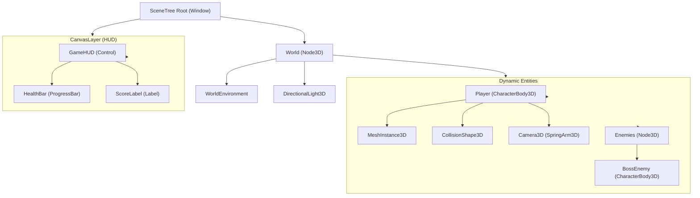
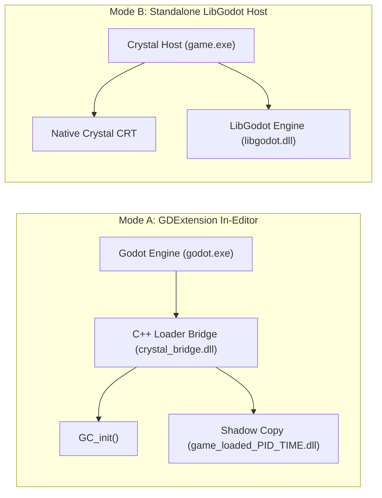
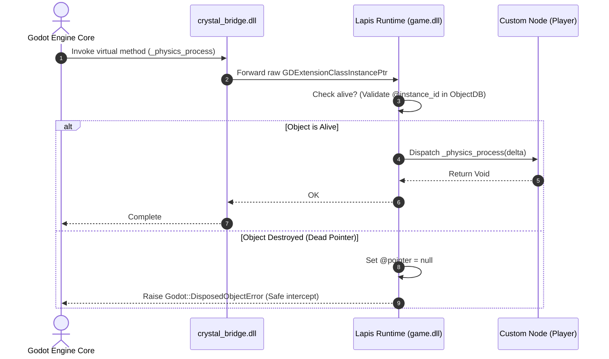
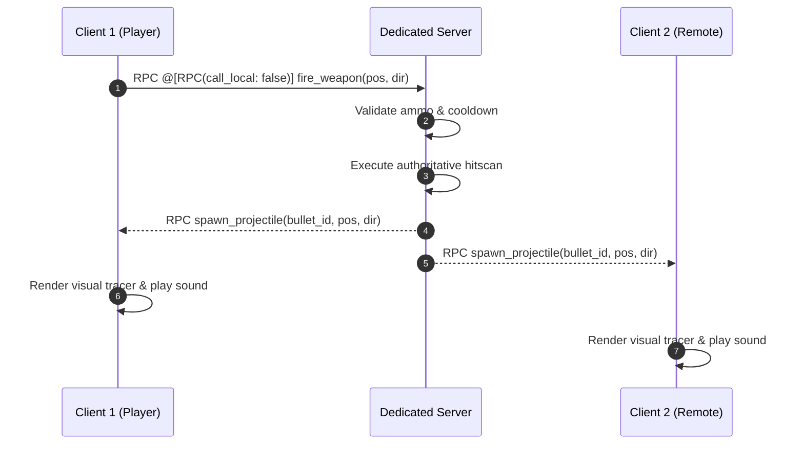
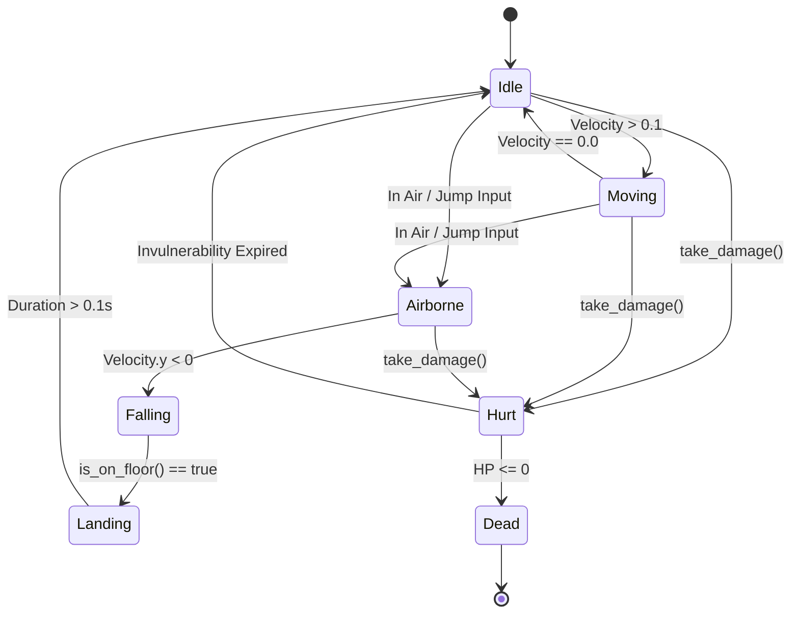
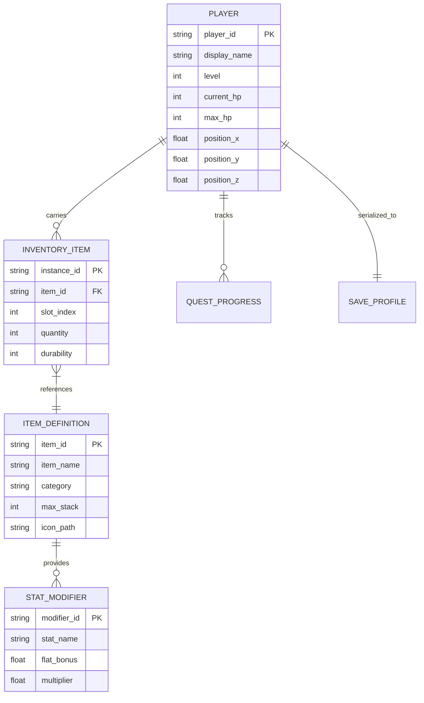

# Mermaid Architecture & System Diagramming Guide

This skill is the authoritative engineering guide for designing, authoring, and styling clear, professional **Mermaid diagrams** across game architectures, engine subsystems, SceneTree hierarchies, finite state machines, network protocols, and data models.

---

## Table of Contents
<table>
  <thead>
    <tr>
      <th align="left">Section</th>
      <th align="left">Description</th>
      <th align="center">Lines</th>
    </tr>
  </thead>
  <tbody>
    <tr>
      <td><a href="#1-core-principles-formatting-rules"><strong>1. Core Principles & Formatting Rules</strong></a></td>
      <td>When authoring Mermaid diagrams for technical documentation, architectural reviews, or AI artifact presenta...</td>
      <td align="center"><code>L65–L90</code></td>
    </tr>
    <tr>
      <td><a href="#2-diagram-type-selector-reference"><strong>2. Diagram Type Selector Reference</strong></a></td>
      <td><table></td>
      <td align="center"><code>L91–L136</code></td>
    </tr>
    <tr>
      <td><a href="#3-game-architecture-scenetree-flowcharts"><strong>3. Game Architecture & SceneTree Flowcharts</strong></a></td>
      <td>### Godot SceneTree Composition:</td>
      <td align="center"><code>L137–L203</code></td>
    </tr>
    <tr>
      <td><a href="#4-sequence-diagrams-gdextension-networking"><strong>4. Sequence Diagrams: GDExtension & Networking</strong></a></td>
      <td>### GDExtension Function Call & Dead-Pointer Validation:</td>
      <td align="center"><code>L204–L247</code></td>
    </tr>
    <tr>
      <td><a href="#5-state-diagrams-gameplay-ai"><strong>5. State Diagrams: Gameplay & AI</strong></a></td>
      <td>### Character Movement Finite State Machine:</td>
      <td align="center"><code>L248–L275</code></td>
    </tr>
    <tr>
      <td><a href="#6-entity-relationship-diagrams-data-save-files"><strong>6. Entity-Relationship Diagrams: Data & Save Files</strong></a></td>
      <td>### Inventory & Equipment Data Model:</td>
      <td align="center"><code>L276–L323</code></td>
    </tr>
    <tr>
      <td><a href="#7-styling-theming-best-practices"><strong>7. Styling, Theming & Best Practices</strong></a></td>
      <td>1.</td>
      <td align="center"><code>L324–L341</code></td>
    </tr>
  </tbody>
</table>

---

## 1. Core Principles & Formatting Rules

When authoring Mermaid diagrams for technical documentation, architectural reviews, or AI artifact presentation:

1. **Quote Labels with Special Characters**:
   Always wrap node labels containing parentheses, brackets, colons, or punctuation in double quotes:
   - *Correct*: `A["Player (CharacterBody2D)"] --> B["Camera (Camera3D)"]`
   - *Incorrect*: `A[Player (CharacterBody2D)] --> B[Camera (Camera3D)]` (causes parser crash)
2. **Never Use Unsupported Diagram Types**:
   Only use standard supported diagram types:
   - Flowcharts / Graphs: `flowchart TD` / `flowchart LR` / `graph TD` / `graph LR`
   - Sequence Diagrams: `sequenceDiagram`
   - State Diagrams: `stateDiagram-v2` or `stateDiagram`
   - Class Diagrams: `classDiagram`
   - Entity-Relationship Diagrams: `erDiagram`
   - XY Charts: `xychart-beta`
3. **Avoid HTML Tags in Labels**:
   Do not embed raw HTML `<br>`, `<b>`, or `<span>` inside node text; use multiple nodes, subgraphs, or newline characters (`\n` within quotes) instead.
4. **Choose Direction Deliberately**:
   - Use `flowchart TD` (Top-Down) for hierarchy trees, SceneTrees, and ASTs.
   - Use `flowchart LR` (Left-to-Right) for pipelines, lifecycle sequences, build pipelines, and data flows.
5. **Group Related Components in Subgraphs**:
   Use `subgraph Title` ... `end` to delineate architectural boundaries (e.g. Main Thread vs Worker Threads, Engine vs Scripting, Client vs Server).

---

## 2. Diagram Type Selector Reference

<table>
  <thead>
    <tr>
      <th align="left">Diagram Type</th>
      <th align="left">Header Keyword</th>
      <th align="left">Primary Game Development Use Cases</th>
    </tr>
  </thead>
  <tbody>
    <tr>
      <td><strong>Flowchart / Graph</strong></td>
      <td><code>flowchart TD</code> / <code>LR</code></td>
      <td>SceneTree hierarchies, build pipelines, execution flows, dependency DAGs</td>
    </tr>
    <tr>
      <td><strong>State Diagram</strong></td>
      <td><code>stateDiagram-v2</code></td>
      <td>Character FSMs, weapon reload states, menu navigation, game loop phases</td>
    </tr>
    <tr>
      <td><strong>Sequence Diagram</strong></td>
      <td><code>sequenceDiagram</code></td>
      <td>GDExtension FFI calls, multiplayer RPC sync, signal emission, asset loading</td>
    </tr>
    <tr>
      <td><strong>Class Diagram</strong></td>
      <td><code>classDiagram</code></td>
      <td>ClassDB inheritance, custom node composition, design patterns (GoF)</td>
    </tr>
    <tr>
      <td><strong>Entity-Relationship</strong></td>
      <td><code>erDiagram</code></td>
      <td>Save game databases, item inventory schemas, player profile progression</td>
    </tr>
    <tr>
      <td><strong>XY Chart</strong></td>
      <td><code>xychart-beta</code></td>
      <td>Performance benchmarks, frame time distribution, memory allocation profiles</td>
    </tr>
  </tbody>
</table>

---

## 3. Game Architecture & SceneTree Flowcharts

### Godot SceneTree Composition:


### Dual-Paradigm Execution Model:


---

## 4. Sequence Diagrams: GDExtension & Networking

### GDExtension Function Call & Dead-Pointer Validation:


### Multiplayer Lockstep RPC Synchronization:


---

## 5. State Diagrams: Gameplay & AI

### Character Movement Finite State Machine:


---

## 6. Entity-Relationship Diagrams: Data & Save Files

### Inventory & Equipment Data Model:


---

## 7. Styling, Theming & Best Practices

1. **Consistent Color Palette**:
   Use Hex codes with clean contrast (e.g., `#2b2d42`, `#8d99ae`, `#edf2f4`, `#ef233c`).
   ```mermaid
   flowchart LR
     A["Input Node"] --> B["Processing Engine"]
     B --> C["Output Display"]

     style A fill:#e0f2fe,stroke:#0284c7,stroke-width:2px,color:#0369a1
     style B fill:#fef3c7,stroke:#d97706,stroke-width:2px,color:#92400e
     style C fill:#dcfce7,stroke:#16a34a,stroke-width:2px,color:#15803d
   ```
2. **Keep Diagrams Modular**:
   If a diagram exceeds 20 nodes, break it down into focused sub-diagrams (e.g. one for Combat, one for AI, one for UI).
3. **Use Markdown Artifact Fencing**:
   Always fence diagrams with ` ```mermaid ` and ensure proper indentation.
