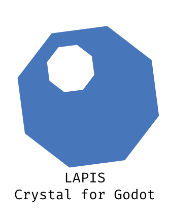
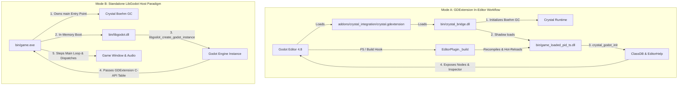

<p align="center">
  
</p>

# Lapis for Crystal

<!-- carbon:badges -->
[](https://crystal-lang.org)
[](https://github.com/sol-vin/lapis/releases)
[](https://godotengine.org)
[](https://github.com/sol-vin/lapis/actions/workflows/test.yml)
[](https://github.com/sol-vin/lapis/actions/workflows/release.yml)
[](https://sol-vin.github.io/lapis/)
[](https://sol-vin.github.io/lapis/benchmarks.html)
[](https://sol-vin.github.io/lapis_slides/)
[](LICENSE)
<!-- /carbon:badges -->

**Lapis for Crystal** provides high-performance Crystal bindings and a bidirectional runtime integration for **Godot Engine 4.8+** using LibGodot and GDExtension. It empowers developers to build Godot games with native LLVM machine speed, compile-time static type safety, and Ruby-like syntax elegance.

▶️ **Watch the Video Tour**: [https://youtu.be/EKMw_zQjovc](https://youtu.be/EKMw_zQjovc)  
📖 **Official Documentation**: [https://sol-vin.github.io/lapis/](https://sol-vin.github.io/lapis/)  
📊 **Interactive Benchmarks**: [https://sol-vin.github.io/lapis/benchmarks.html](https://sol-vin.github.io/lapis/benchmarks.html)  
📑 **Interactive Slide Deck**: [https://sol-vin.github.io/lapis_slides/](https://sol-vin.github.io/lapis_slides/)  

---

## Why Lapis?

<table>
  <thead>
    <tr>
      <th align="left">Dimension</th>
      <th align="left">Lapis (Crystal)</th>
      <th align="left">GDScript</th>
      <th align="left">C# (.NET)</th>
      <th align="left">C++ (GDExtension)</th>
    </tr>
  </thead>
  <tbody>
    <tr>
      <td><strong>Execution Speed</strong></td>
      <td><strong>Native LLVM machine code</strong> (<code>-O3</code> auto-vectorization)</td>
      <td>Interpreted bytecode / VM stack overhead</td>
      <td>JIT compilation, GC pause overhead</td>
      <td>Native C++ machine code</td>
    </tr>
    <tr>
      <td><strong>Type Safety</strong></td>
      <td><strong>Exhaustive compile-time typing</strong> &amp; nil-safety</td>
      <td>Optional gradual typing (runtime checks)</td>
      <td>Static typing with nullable annotations</td>
      <td>Static typing, manual memory hazards</td>
    </tr>
    <tr>
      <td><strong>Memory Model</strong></td>
      <td>Boehm GC + <strong>64-bit ObjectDB dead-pointer guards</strong></td>
      <td>Engine RefCounted / manual free</td>
      <td>CLR Garbage Collector + interop wrappers</td>
      <td>Manual allocation, dangling pointers / UB</td>
    </tr>
    <tr>
      <td><strong>Syntax Elegance</strong></td>
      <td><strong>Ruby-like expressive DSL</strong>, blocks, macros, union types</td>
      <td>Python-like concise scripting</td>
      <td>Verbose C-style OOP boilerplate</td>
      <td>Verbose header/source separation &amp; macros</td>
    </tr>
    <tr>
      <td><strong>Hot Reloading</strong></td>
      <td><strong>Shadow DLL loading</strong> (bypasses Windows file locks on F5)</td>
      <td>Native script reload</td>
      <td>Domain reload (requires editor restart on edge cases)</td>
      <td>File-locked on Windows without custom loader</td>
    </tr>
    <tr>
      <td><strong>Native Debugger</strong></td>
      <td><strong>In-editor radare2</strong>: pseudo-C decompilation (<code>pdc</code>) &amp; gutter sync</td>
      <td>Engine GDScript debugger</td>
      <td>External IDE debugger (VS Code / Rider)</td>
      <td>External native debugger (GDB / MSVC / LLDB)</td>
    </tr>
    <tr>
      <td><strong>Editor Automation</strong></td>
      <td><strong>Action Driver</strong>: DOM inspection, REPL, and Set-of-Marks AI Vision</td>
      <td>EditorScript (limited headless execution)</td>
      <td>None</td>
      <td>Custom C++ editor modules</td>
    </tr>
  </tbody>
</table>

---

## Table of Contents

- [Architecture: Dual-Paradigm Integration](#architecture-dual-paradigm-integration)
- [Production Gameplay DSL & Ergonomics](#production-gameplay-dsl--ergonomics)
  - [Showcase Quickstart Node](#showcase-quickstart-node)
  - [Typed Scene Pipeline & Queries](#typed-scene-pipeline--queries)
  - [Type-Safe Tween Orchestration](#type-safe-tween-orchestration)
  - [Pattern Matching (`match`)](#pattern-matching-match)
  - [Gameplay Patterns: FSM, Signal Bus & Pooling](#gameplay-patterns-fsm-signal-bus--pooling)
- [In-Editor Action Driver ("Selenium for Godot Editor")](#in-editor-action-driver-selenium-for-godot-editor)
- [Native In-Editor radare2 Debugger & Decompiler](#native-in-editor-radare2-debugger--decompiler)
- [Interactive Opal TUI Hub (`lapis cli`)](#interactive-opal-tui-hub-lapis-cli)
- [Memory Safety & Dead-Pointer Defense](#memory-safety--dead-pointer-defense)
- [Performance & Benchmarks](#performance--benchmarks)
- [Unified Multi-Tier Test Suite](#unified-multi-tier-test-suite)
- [Lapis CLI Toolchain Reference](#lapis-cli-toolchain-reference)
- [Comprehensive In-Code Documentation (`Lapis::Docs`)](#comprehensive-in-code-documentation-lapisdocs)
- [Prerequisites & Installation](#prerequisites--installation)
- [Repository Structure](#repository-structure)
- [License](#license)

---

## Architecture: Dual-Paradigm Integration

Lapis provides two execution paradigms designed for both rapid in-editor iteration and lean standalone production shipping:



<table>
  <thead>
    <tr>
      <th align="left">Paradigm</th>
      <th align="left">Mode A: GDExtension In-Editor</th>
      <th align="left">Mode B: Standalone LibGodot Host</th>
    </tr>
  </thead>
  <tbody>
    <tr>
      <td><strong>Host Binary</strong></td>
      <td>Godot Engine (<code>godot.exe</code>)</td>
      <td>Crystal Executable (<code>bin/game.exe</code>)</td>
    </tr>
    <tr>
      <td><strong>Primary Binaries</strong></td>
      <td><code>bin/crystal_bridge.dll</code> + <code>bin/game.dll</code></td>
      <td><code>bin/libgodot.dll</code> (or <code>.so</code>)</td>
    </tr>
    <tr>
      <td><strong>GC Bootstrapping</strong></td>
      <td>Initialized by C++ loader bridge (<code>GC_init()</code>)</td>
      <td>Initialized natively by Crystal CRT</td>
    </tr>
    <tr>
      <td><strong>Hot Reloading</strong></td>
      <td>Timestamped shadow DLL loading on <strong>F5</strong> / <strong>F6</strong></td>
      <td>Recompilation of standalone executable required</td>
    </tr>
    <tr>
      <td><strong>Primary Use Case</strong></td>
      <td>Rapid development, tool scripts, level design</td>
      <td>Production shipping, headless CI, embedded runners</td>
    </tr>
  </tbody>
</table>

### Windows Shadow Loading
On Windows, dynamic libraries loaded via `LoadLibraryA` are locked by the OS kernel, preventing compilers from overwriting `game.dll`. In development mode, `crystal_bridge.cpp` copies `game.dll` to a timestamped shadow file (`game_loaded_<PID>_<TIMESTAMP>.dll`) and loads the shadow copy. `bin/game.dll` remains completely unlocked so Crystal can recompile freely while the Godot Editor stays open.

---

## Production Gameplay DSL & Ergonomics

### Showcase Quickstart Node

Here is an idiomatic Lapis character node demonstrating property exports, `@onready` path unrolling, signals, tweening, pattern matching, direct space physics queries, and dead-pointer safety:

```crystal
require "lapis"

# Player character with physics movement, combat raycasting, and animations
node Player < CharacterBody3D do
  # Scene unique node references resolved and cached during _ready
  onready visual_mesh : MeshInstance3D = ~"%VisualMesh"
  onready collider : CollisionShape3D = ~"CollisionShape3D"

  # Inspector export system with ranges, steps, and tooltips
  @[Export(range: 1.0_f32..25.0_f32, step: 0.5_f32)]
  property move_speed : Float32 = 8.0_f32

  @[Export(range: 1.0_f32..30.0_f32, step: 0.5_f32)]
  property jump_velocity : Float32 = 9.5_f32

  @[Export(range: 10..500, step: 10)]
  property max_health : Int32 = 100

  # First-class type-safe signals
  signal health_changed(current : Int32, max_health : Int32)
  signal died

  @current_health : Int32 = 100

  def _ready : Void
    @current_health = @max_health
    Godot.print("Player initialized: #{name}")
  end

  def _physics_process(delta : Float64) : Void
    vel = velocity

    # Apply gravity when airborne
    unless is_on_floor
      vel.y -= 24.0_f32 * delta.to_f32
    end

    # Handle jump impulse
    if Input.is_action_just_pressed("jump") && is_on_floor
      vel.y = @jump_velocity
    end

    # Vectorized movement direction
    input_dir = Input.get_vector("move_left", "move_right", "move_forward", "move_back")
    dir = (transform.basis * Vector3.new(input_dir.x, 0.0_f32, input_dir.y)).normalized

    if dir.length > 0.001_f32
      vel.x = dir.x * @move_speed
      vel.z = dir.z * @move_speed
    else
      vel.x = Math.move_toward(vel.x, 0.0_f32, @move_speed * delta.to_f32)
      vel.z = Math.move_toward(vel.z, 0.0_f32, @move_speed * delta.to_f32)
    end

    self.velocity = vel
    move_and_slide

    # Fire weapon raycast on attack action
    if Input.is_action_just_pressed("fire")
      fire_weapon
    end
  end

  # Performs a direct space physics raycast
  private def fire_weapon : Void
    start_pos = global_position + Vector3.new(0.0_f32, 1.2_f32, 0.0_f32)
    target_pos = start_pos + (-transform.basis.z * 50.0_f32)

    # One-liner direct space query returning typed PhysicsHit3D
    if hit = raycast_to(target_pos, from: start_pos)
      # Expression pattern matching with dead-pointer safe downcasting
      match hit.collider do
        is Enemy do |enemy|
          enemy.take_damage(25)
          flash_hit_marker
        end
        default do
          Godot.print("Hit scenery at #{hit.position}")
        end
      end
    end
  end

  # Statement-based tween orchestration with auto call-peeling and typed identifiers
  private def flash_hit_marker : Void
    tween(self) do
      animate(visual_mesh.scale, to: Vector3.new(1.15_f32, 1.15_f32, 1.15_f32), in: 0.08.seconds)
      trans(Trans.Back)
      ease(Ease.Out)
      chain()
      animate(visual_mesh.scale, to: Vector3.new(1.0_f32, 1.0_f32, 1.0_f32), in: 0.12.seconds)
      trans(Trans.Cubic)
      ease(Ease.In)
    end
  end

  # Inflicts damage, emits signals, and handles death
  def take_damage(amount : Int32) : Void
    return if @current_health <= 0
    @current_health = Math.max(0, @current_health - amount)
    emit_health_changed(@current_health, @max_health)

    if @current_health <= 0
      emit_died
      queue_free
    end
  end
end
```

---

### Typed Scene Pipeline & Queries

Lapis introduces expressive pipeline and query operators that eliminate boilerplate typecasts:

```crystal
# 1. Preload Pipeline (>): Preload PackedScene, instantiate, and cast to concrete node
enemy = "res://scenes/enemy.tscn" > Enemy do |e|
  e.position = Vector3.new(10.0, 0.0, 5.0)
end

# 2. Dynamic Load Pipeline (>>): Load dynamically at runtime without caching
boss = "res://scenes/boss.tscn" >> Boss

# 3. Symmetrical Upward Ancestor Resolution (<<): Find nearest parent in hierarchy
player = hitbox << Player     # Strict: returns Player or raises NodeNotFoundError
boss = hitbox << Boss?        # Nilable: returns Boss? or nil if not found

# 4. Wildcard Scene Glob Queries (*):
all_enemies = self * "Enemies/*"                    # Array(Node)
all_lights  = self * "**/Light*"                    # Recursive globstar
all_areas   = self * {"HitBoxes/*", Area3D}         # Typed: Array(Area3D)
regex_boxes = self * /^HitBox_\d+$/                 # Regex: Array(Node)
hitbox      = self["Enemies/*/Hitbox", Area2D]?     # Nilable: returns nil if empty!

# 5. Zero-Allocation Streaming Iteration:
each_node("Enemies/*", Enemy) do |enemy|
  enemy.take_damage(50)
end

# 6. Fluent Group Queries (group):
group(:enemies).each(as: Enemy) do |enemy|
  enemy.alert!(player.global_position)
end
group(:enemies).call("wake_up")
alive_count = group(:enemies).size
```

---

### Type-Safe Tween Orchestration

The `tween` macro peels apart block statements into a fluent pipeline, strictly verifying typed property identifiers at compile time:

```crystal
# Statement-based tween pipeline with auto call-peeling, easing curves, and typed identifiers
tw = tween(hero) do
  animate(position, to: Vector2.new(120, 80), in: 4.seconds)
  chain()
  animate(modulate, from: Color::RED, to: Color::BLUE, in: 0.3.seconds)
  parallel()
  ease(Ease.Out)
  trans(Trans.Cubic)
  animate(scale, to: Vector2.new(1.2, 1.2), in: 0.3.seconds)
  chain()
  animate(modulate.a, to: 0.0, in: 0.25.seconds)
end

# Non-blocking cooperative await on the tween's completion
await(tw.finished)
```

---

### Pattern Matching (`match`)

Game development frequently deals with polymorphic nodes, dynamic `Variant` payloads, and input dictionaries. The `match` macro handles these with zero-allocation inlined execution:

```crystal
match event do
  # Variant unboxing & dead-pointer safe downcasting
  is Player do |player|
    Godot.print("Player HP: #{player.max_health}")
  end

  # Guard clauses with if: condition
  is Enemy, if: event.level > 50 do |boss|
    trigger_boss_music(boss)
  end

  # Symbol / String equivalence
  is :action_jump, :action_vault do
    player.execute_aerial_move
  end

  # Tuple destructuring
  is {state, on_floor?} do
    is :jumping, false do apply_air_control end
    is :jumping, true  do trigger_landing_dust end
  end

  default do
    handle_unhandled_event
  end
end
```

---

### Gameplay Patterns: FSM, Signal Bus & Pooling

```crystal
# 1. Zero-Allocation Typed Union FSM
struct Idle; end
struct Walking; getter speed : Float32 = 6.0_f32; end
struct Attacking; getter combo : Int32 = 1; end

alias State = Idle | Walking | Attacking

node CombatUnit < CharacterBody3D do
  fsm State, initial: Idle.new do
    on_enter Walking do |w|
      Godot.print("Walking at speed #{w.speed}")
    end
    on_exit Attacking do
      reset_combo_timer
    end
  end
end

# 2. Type-Safe Decoupled Signal Bus
signal_bus GameEvents do
  signal score_changed(new_score : Int32)
  signal player_died
end

# Emitter:
GameEvents.instance.score_changed.emit(100)

# Receiver:
GameEvents.instance.score_changed.connect do |score|
  ui_label.text = "Score: #{score}"
end

# 3. High-Performance Object Pool
class Arena < Node2D
  node_pool bullets : Bullet, capacity: 64

  def fire_volley(at_pos : Vector2) : Void
    bullet = bullets.acquire do |b|
      b.position = at_pos
      b.velocity = Vector2.new(500.0, 0.0)
    end
  end
end
```

---

## In-Editor Action Driver ("Selenium for Godot Editor")

Lapis includes the **Action Driver**, a programmatic UI inspection, automation, and testing framework for the Godot Editor. It provides DOM traversal, synthetic inputs, state preservation across reloads, and Set-of-Marks AI Vision generation:

```
[ Lapis Action Driver ] ──TCP:9095──> [ Godot Editor 4.8 ]
       │                                     │
       ├─ click "Build"                      ├─ Finds Control via DOM predicate
       ├─ type "%SearchEdit" "Player"        ├─ Synthesizes InputEventKey / Mouse
       ├─ open-scene "res://test.tscn"       ├─ EditorInterface scene dispatch
       └─ vision --output reports/ai         └─ Generates Set-of-Marks AI Manifest
```

### CLI Commands:
```bash
# Click a button in the Godot Editor UI
lapis driver click "Build"

# Type text into a LineEdit or search filter
lapis driver type "%FilterEdit" "Player"

# Switch main editor screens (2D, 3D, Script, Crystal)
lapis driver screen 3D

# Generate Set-of-Marks AI Vision manifest & cropped widget images
lapis driver vision --output reports/ai_vision

# Dump the live Godot Editor DOM tree hierarchy
lapis driver dom 8

# Launch interactive Action Driver REPL
lapis driver repl
```

---

## Native In-Editor radare2 Debugger & Decompiler

Powered by `sol-vin/cradare2`, Lapis embeds a native multi-threaded debugger directly inside the Godot Editor:

- **Gutter Breakpoint Sync**: Set breakpoints directly in Godot's Script Editor gutter (`F9`). Breakpoints are synchronized with radare2 via source line matching (`dbl`) instantly.
- **Dedicated In-Editor Tab**: Docked **Crystal Debugger** tab featuring Continue (`F5`), Step Over (`F10`), Step Into (`F11`), Step Out (`Shift+F11`), call stack frame navigation, and CPU register inspection (`RAX`, `RBX`, `RIP`, `RSP`).
- **Live Pseudo-C Decompiler (`pdc`)**: Built-in side-by-side view with native pseudo-C (`pdc`) decompilation and annotated assembly (`pdf`/`pdca`) with zero external decompiler dependencies.
- **Multiplayer Lockstep Break**: When any peer hits a breakpoint, all other active instances are automatically paused via cooperative interrupt (`DebugBreakProcess` / `SIGINT`) to eliminate network heartbeat timeouts (ENet / WebRTC).
- **Dead-Pointer Forensics**: Automatically inspects faulting memory addresses, classifies loaded modules, and checks 64-bit ObjectDB IDs to diagnose dead pointers.

```bash
# Launch test project under native radare2 debugger
lapis run -d

# Launch Godot Editor under native radare2 debugger
lapis editor -d

# Decompile symbol directly from terminal
lapis decompile bin/game.dll "*Player*physics_process*" --side-by-side
```

---

## Interactive Opal TUI Hub (`lapis cli`)

Lapis includes an interactive full-screen terminal command center powered by **Opal** (`sol-vin/opal`). Launch it with `lapis cli` (or `lapis -i`):

```
┌── Lapis Engine Command Hub (v0.0.264) ───────────────────────── [Godot 4.8-dev7] ──┐
│                                                                                    │
│   [+] New Project / Addon Wizard      Interactive folder & template scaffold       │
│   [#] Launch Godot Editor             Persistent launcher with log watching        │
│   [A] Action Driver Controller        DOM automation REPL & AI vision capturer     │
│   [B] Packaging & Export Center       Multi-target builds & release packaging      │
│   [D] Radare2 Native Debugger         Registers, disassembly & hex memory view     │
│   [L] Diagnostic Log Viewer           Real-time log tailing & channel filters      │
│   [#] Benchmark Visualizer            Cartesian charts, percentiles & memory delta │
│   [~] Run Game (Performance Monitor)  Live FPS/memory charts with Ctrl+K stop      │
│   [?] Test Suites Dashboard           Multi-phase test runner with split-screen    │
│   [+] Toolchain Doctor                Environment & dependency health check        │
│   [~] Synchronize Multi-Targets       Sync bridge DLLs and manifests across targets│
│   [x] Clean Build Artifacts           Prune binaries & unlock shadow DLLs          │
│   [=] Generate Documentation          Build static offline HTML documentation site │
│                                                                                    │
├────────────────────────────────────────────────────────────────────────────────────┤
│ [↑/↓] Navigate  │  [Enter] Launch  │  [Ctrl+P] Command Palette  │  [Q] Exit        │
└────────────────────────────────────────────────────────────────────────────────────┘
```

Press **`Ctrl+P`** from any screen to open the global floating **Command Palette** for instant fuzzy search across all 35+ CLI tools and actions.

---

## Memory Safety & Dead-Pointer Defense

Embedding a garbage-collected language (Crystal Boehm GC) inside a native C++ engine (Godot ObjectDB) introduces a critical hazard: when Godot frees an object (e.g. via `queue_free()`), standard C-API bindings retain a raw pointer to dead memory. Dereferencing it triggers an unrecoverable **segmentation fault (`ACCESS_VIOLATION / SIGSEGV`)**.

```
[ Crystal Runtime ]                              [ Godot Engine / GDScript ]
  enemy = get_node("Enemy")
  enemy.@pointer = 0x7FFE_1234  ────────────>     Node instance at 0x7FFE_1234
                                                      │
                                                      │ GDScript: enemy.queue_free()
                                                      ▼
                                                   ObjectDB destroys Node & frees memory!
                                                   0x7FFE_1234 is now DEAD / UNMAPPED!
  enemy.position = Vector3.new(...)
        │
        ▼
  [ Lapis check_alive! ]
        │
        ├───── Query ObjectDB for monotonic 64-bit instance ID: ID is INVALID!
        ├───── Marks wrapper dead (@pointer = null)
        └───── Raises Godot::DisposedObjectError (Clean, catchable Crystal exception!)
               [ ZERO NATIVE CRASHES ]
```

### Safety Invariants:
1. **Monotonic 64-bit Instance ID Tracking**: Every `Godot::Object` wrapper tracks its engine-assigned ID. Godot's ObjectDB monotonic IDs never collide with recycled heap addresses.
2. **Pre-Dispatch Liveness Check (`#check_alive!`)**: Before dispatches or reflection calls, Lapis validates liveness in O(1) time (`Bridge.is_instance_valid(instance_id)`).
3. **Graceful `DisposedObjectError`**: If an object is freed, Lapis marks the pointer null and raises `Godot::DisposedObjectError` instead of crashing.
4. **Defensive Inspection**: Check `node.alive?` or `node.destroyed?` before interacting with transient entities.
5. **Main-Thread SceneTree Affinity**: Scene graph mutations (`add_child`, `remove_child`, `queue_free`) enforce main-thread execution (`assert_main_thread!`) with automatic thread-safe deferral (`call_deferred` / `Godot.on_main_thread`).
6. **Dead-Pointer Armor (`try?` & `if_alive`)**: Safely invoke methods on nilable or transient objects with `@heal_sfx.try?(&.play)` or `@target.try?(&.take_damage(spell.power))`. `try?` automatically queries Godot's ObjectDB monotonic ID table and returns `nil` safely if the object was freed or `nil`, eliminating C#'s `.NET ?.` `ObjectDisposedException` trap.

---

## Performance & Benchmarks

Lapis features an automated 1-to-1 cross-language benchmark suite comparing native compiled **Crystal (GDExtension)** against **GDScript (Godot 4 Bytecode)**:

> 📊 **Explore the Live Dashboard**: [https://sol-vin.github.io/lapis/benchmarks.html](https://sol-vin.github.io/lapis/benchmarks.html)

<table>
  <thead>
    <tr>
      <th align="left">Benchmark Category</th>
      <th align="left">Included Benchmarks</th>
      <th align="left">Speedup vs GDScript</th>
      <th align="left">Key Architectural Advantage</th>
    </tr>
  </thead>
  <tbody>
    <tr>
      <td><strong>Algorithmic &amp; Compute</strong></td>
      <td><code>Matmul</code>, <code>Primes</code>, <code>Brainfuck</code>, <code>Base64</code>, <code>JSON</code>, <code>NBody</code>, <code>BinaryTrees</code>, <code>Mandelbrot</code>, <code>TransformMath</code></td>
      <td><strong>3.1x – 227.6x faster</strong></td>
      <td>LLVM <code>-O3</code> auto-vectorization, native unboxed arithmetic, zero Variant boxing.</td>
    </tr>
    <tr>
      <td><strong>Godot Engine Core</strong></td>
      <td><code>NodeLifecycle</code>, <code>MaterialResources</code>, <code>Signals</code></td>
      <td><strong>1.1x – 307.7x faster</strong></td>
      <td>Direct GDExtension C-API dispatch, low GC pause times, fast resource allocation.</td>
    </tr>
  </tbody>
</table>

### Running Benchmarks Locally:
```bash
# Run all benchmarks and generate HTML/SVG reports
lapis benchmarks [ITERATIONS=3]

# Run specific categories or filters
crystal run benchmarks/runner.cr -- -c compute
crystal run benchmarks/runner.cr -- -c engine
crystal run benchmarks/runner.cr -- --filter=signals
```

---

## Unified Multi-Tier Test Suite

Lapis enforces quality through an automated test harness covering language bindings, in-editor tool execution, and standalone runtimes:

1. **Engine Core Specs (`spec/`)**: Headless unit specs covering GC object retention, dynamic scaling, Variant type round-trips, and Vector math (`spec/core_spec.cr`, `spec/math_spec.cr`, `spec/safety_spec.cr`).
2. **Lapis CLI Specs (`tools/lapis/spec/`)**: CLI argument parsing, standalone execution, and packaging tests (`tools/lapis/spec/cli_spec.cr`).
3. **85+ Modular Runtime Suites (`spec/suites/`)**: Comprehensive engine verification covering 2D/3D nodes, navigation, physics, multiplayer, shaders, audio servers, FSM, and memory lifecycle.
4. **Quantitative Zero-Leak Verification**: `Lapis::Test.assert_no_leak` leverages Godot's `Performance` monitors (`OBJECT_COUNT`, `OBJECT_NODE_COUNT`, `MEMORY_STATIC`) and Crystal's `GC.collect` to mathematically verify zero object or memory leaks.

```bash
# Run the complete test suite (interactive TUI or streaming)
make test
lapis test

# Run headless specs only
make spec
```

---

## Lapis CLI Toolchain Reference

The `lapis` CLI (`bin/lapis` / `bin/lapis.exe`) provides a unified developer toolchain:

<table>
  <thead>
    <tr>
      <th align="left">Command</th>
      <th align="left">Category</th>
      <th align="left">Description</th>
    </tr>
  </thead>
  <tbody>
    <tr>
      <td><code>lapis cli</code> (or <code>lapis -i</code>)</td>
      <td>Interactive Hub</td>
      <td>Launches the 14-workspace Opal TUI dashboard with floating Command Palette (<code>Ctrl+P</code>).</td>
    </tr>
    <tr>
      <td><code>lapis driver [cmd]</code></td>
      <td>Editor Automation</td>
      <td>In-Editor Action Driver controller, interactive REPL, and Set-of-Marks AI Vision generation.</td>
    </tr>
    <tr>
      <td><code>lapis doctor</code></td>
      <td>Diagnostics</td>
      <td>Diagnoses environment health (Crystal, Godot, C++ compiler, radare2, packaging dependencies).</td>
    </tr>
    <tr>
      <td><code>lapis build [target]</code></td>
      <td>Build &amp; Sync</td>
      <td>Compiles Crystal targets (<code>game</code>, <code>plugin</code>, <code>tests</code>, <code>bench</code>) with automatic flag resolution.</td>
    </tr>
    <tr>
      <td><code>lapis sync</code></td>
      <td>Build &amp; Sync</td>
      <td>Synchronizes compiled binaries, runtime DLLs (GC, iconv, PCRE2, LibGodot), and manifests across targets.</td>
    </tr>
    <tr>
      <td><code>lapis editor</code></td>
      <td>Editor Launcher</td>
      <td>Launches Godot Editor with log monitoring, build hooks, and radare2 debugger support.</td>
    </tr>
    <tr>
      <td><code>lapis run</code></td>
      <td>Runner</td>
      <td>Runs Godot project standalone with live FPS and memory metrics.</td>
    </tr>
    <tr>
      <td><code>lapis test [options]</code></td>
      <td>Testing</td>
      <td>Unified multi-tier test runner with interactive TUI or non-TTY streaming logs.</td>
    </tr>
    <tr>
      <td><code>lapis new &lt;game|addon|example&gt; [name]</code></td>
      <td>Scaffolding</td>
      <td>Scaffolds a new game, redistributable GDExtension addon, or showcase example from templates.</td>
    </tr>
    <tr>
      <td><code>lapis init [path]</code></td>
      <td>Project Management</td>
      <td>Initializes Crystal/Lapis integration into an existing Godot project.</td>
    </tr>
    <tr>
      <td><code>lapis bind &lt;engine|project&gt;</code></td>
      <td>Code Generation</td>
      <td>Generates typed Crystal API bindings for Godot classes or custom GDScript project nodes.</td>
    </tr>
    <tr>
      <td><code>lapis package [target]</code></td>
      <td>Packaging</td>
      <td>Packages playable standalone game executables or distribution zip archives.</td>
    </tr>
    <tr>
      <td><code>lapis decompile &lt;bin&gt; &lt;sym&gt;</code></td>
      <td>Debugging</td>
      <td>Decompiles functions to pseudo-C (<code>pdc</code>) or disassembles binary using native radare2.</td>
    </tr>
    <tr>
      <td><code>lapis analyze &lt;bin&gt;</code></td>
      <td>Debugging</td>
      <td>Performs deep static and dynamic radare2 binary and security analysis.</td>
    </tr>
    <tr>
      <td><code>lapis log [options]</code></td>
      <td>Logging</td>
      <td>Views, tails, searches, exports, and filters diagnostic logs.</td>
    </tr>
    <tr>
      <td><code>lapis shard &lt;cmd&gt;</code></td>
      <td>Dependencies</td>
      <td>Manages Crystal shard dependencies in the Godot project (list, install, uninstall, prune).</td>
    </tr>
    <tr>
      <td><code>lapis addon &lt;cmd&gt;</code></td>
      <td>Dependencies</td>
      <td>Installs, uninstalls, or manages Godot GDExtension addons.</td>
    </tr>
    <tr>
      <td><code>lapis ide [editor]</code></td>
      <td>Tooling</td>
      <td>Configures VS Code, Cursor, Zed, or Neovim with Crystalline LSP and radare2 debugging.</td>
    </tr>
    <tr>
      <td><code>lapis template &lt;cmd&gt;</code></td>
      <td>Templates</td>
      <td>Manages global project templates (save, list, remove, clean, export, import).</td>
    </tr>
    <tr>
      <td><code>lapis clean [options]</code></td>
      <td>Maintenance</td>
      <td>Prunes compiled binaries, intermediate objects, and shadow DLLs.</td>
    </tr>
    <tr>
      <td><code>lapis docs</code></td>
      <td>Documentation</td>
      <td>Generates offline HTML API documentation via <code>crystal docs</code>.</td>
    </tr>
    <tr>
      <td><code>lapis setup</code></td>
      <td>Setup</td>
      <td>Downloads and configures targeted Godot engine binary and dumps GDExtension API.</td>
    </tr>
    <tr>
      <td><code>lapis install</code></td>
      <td>System</td>
      <td>Installs Lapis CLI globally into system/user <code>PATH</code>.</td>
    </tr>
  </tbody>
</table>

---

## Comprehensive In-Code Documentation (`Lapis::Docs`)

Lapis includes an extensive 10-track technical documentation system compiled directly into the code via **Jasper** (`sol-vin/jasper`):

<table>
  <thead>
    <tr>
      <th align="left">Learning Track</th>
      <th align="left">Submodule</th>
      <th align="left">Topics Covered</th>
    </tr>
  </thead>
  <tbody>
    <tr>
      <td><strong>1. Getting Started</strong></td>
      <td><code>Docs::A_GETTING_STARTED</code></td>
      <td>Installation, source compilation, First Game Tutorial (Zero to Hero), Crystal syntax for Godot.</td>
    </tr>
    <tr>
      <td><strong>2. CLI &amp; Toolchain</strong></td>
      <td><code>Docs::B_LAPIS_CLI_AND_TOOLCHAIN</code></td>
      <td>CLI architecture, doctor diagnostics, scaffolding, build &amp; sync, testing, clean, addons, shards, IDE.</td>
    </tr>
    <tr>
      <td><strong>3. Gameplay DSL</strong></td>
      <td><code>Docs::C_GAMEPLAY_AND_DECLARATIVE_DSL</code></td>
      <td>Node DSL, exports, signals, input, scene tree, mixins (<code>gmodule</code>), multiplayer, GDScript migration.</td>
    </tr>
    <tr>
      <td><strong>4. Concurrency &amp; Fibers</strong></td>
      <td><code>Docs::D_CONCURRENCY_AND_FIBERS</code></td>
      <td>Fibers, cooperative signal awaiting, OS background threads, actor channels, main thread dispatch.</td>
    </tr>
    <tr>
      <td><strong>5. Memory Safety</strong></td>
      <td><code>Docs::E_MEMORY_SAFETY_AND_ENGINE_INTERNALS</code></td>
      <td>Godot ObjectDB monotonic IDs, dead-pointer defense, Boehm GC vs Godot reference counting.</td>
    </tr>
    <tr>
      <td><strong>6. Scripting &amp; Interop</strong></td>
      <td><code>Docs::F_SCRIPTING_AND_INTEROPERABILITY</code></td>
      <td>First-class <code>.cr</code> script editing in Godot, GDScript bindings, compile-time doc comment harvesting.</td>
    </tr>
    <tr>
      <td><strong>7. Debugging &amp; Diagnostics</strong></td>
      <td><code>Docs::G_DEBUGGING_AND_DIAGNOSTICS</code></td>
      <td>Native radare2 debugging, gutter breakpoints, pseudo-C decompilation, crash forensics, watchpoints.</td>
    </tr>
    <tr>
      <td><strong>8. Testing &amp; Benchmarks</strong></td>
      <td><code>Docs::H_TESTING_AND_BENCHMARKS</code></td>
      <td>Testing framework, zero memory leak validation, performance profiling, benchmark architecture.</td>
    </tr>
    <tr>
      <td><strong>9. Architecture &amp; Extensions</strong></td>
      <td><code>Docs::I_ARCHITECTURE_AND_EXTENSIONS</code></td>
      <td>Dual-paradigm execution model, C++ loader bridge, multi-addon isolation, engine upgrade guide.</td>
    </tr>
    <tr>
      <td><strong>10. Modern CLI &amp; TUI</strong></td>
      <td><code>Docs::J_MODERN_CLI_AND_TUI</code></td>
      <td>Interactive terminal command center, Opal TUI hub, differential cell rendering, domain workspaces.</td>
    </tr>
  </tbody>
</table>

Build and view documentation locally:
```bash
make docs
# Open docs/index.html in your browser
```

---

## Prerequisites & Installation

### System Dependencies
- **Crystal Compiler**: 1.20+
- **radare2**: 5.8+ (native debugger, disassembler, and decompiler)
- **Godot Engine**: 4.8-dev7+ (Standard build, 64-bit)
- **C++ Compiler**: GCC (`g++`) or Clang (for compiling the GDExtension loader bridge)
- **GNU Make**: Workspace build & synchronization automation
- **Git**: Shards dependency resolution & version control

### Quick Install by Platform

<table>
  <thead>
    <tr>
      <th align="left">Platform</th>
      <th align="left">One-Liner Command to Install Dependencies</th>
    </tr>
  </thead>
  <tbody>
    <tr>
      <td><strong>Windows (Scoop)</strong></td>
      <td><code>scoop install crystal radare2 make git</code></td>
    </tr>
    <tr>
      <td><strong>Windows (Winget)</strong></td>
      <td><code>winget install CrystalLang.Crystal radare2.radare2 ezwinports.make Git.Git</code></td>
    </tr>
    <tr>
      <td><strong>Ubuntu / Debian</strong></td>
      <td><code>sudo apt update &amp;&amp; sudo apt install -y crystal radare2 make git g++</code></td>
    </tr>
    <tr>
      <td><strong>Arch Linux</strong></td>
      <td><code>sudo pacman -S crystal radare2 make git gcc</code></td>
    </tr>
    <tr>
      <td><strong>macOS (Homebrew)</strong></td>
      <td><code>brew install crystal radare2 make git</code></td>
    </tr>
  </tbody>
</table>

### Official Installers
- **Windows Installer (`lapis-setup-windows-x86_64.exe`)**: Installs Lapis CLI, bundles `crystalline.exe` (LSP) and `radare2.exe` (native debugger), configures user `PATH`, and registers PowerShell completions.
- **Debian Package (`lapis_amd64.deb`)**: Installs Lapis globally with automatic package dependency resolution (`Depends: crystal, radare2`).

### Adding to an Existing Project (`shard.yml`):
```yaml
dependencies:
  lapis:
    github: sol-vin/lapis
    branch: 4.8-dev7
```
Run `shards install` to install dependencies.

---

## Repository Structure

```
lapis/
├── src/                          # Reusable Lapis library & root host application
│   ├── libgodot.cr               # Library root entry point (require "libgodot")
│   ├── lapis.cr                  # Lapis prelude & engine extensions
│   ├── main.cr                   # Root host game entry point & test runner panel
│   ├── bridge/crystal_bridge.cpp # C++ GDExtension loader bridge
│   └── libgodot/                 # Core engine C-API, macros, and generated bindings
├── tools/                        # Built-in CLI toolchain
│   └── lapis/                    # Compiled native CLI (bin/lapis)
├── spec/                         # Unified Crystal specifications & test suites
│   ├── spec_helper.cr            # Common spec helper and test nodes
│   ├── editor_driver_spec.cr     # In-editor @tool and runtime tests via EditorDriver
│   ├── suites/                   # 85+ modular engine test suites
│   └── fixtures/                 # Spec test targets & fixtures
├── scenes/                       # Root Godot host project scenes (main_test_runner.tscn, etc.)
├── scripts/                      # GDScript test fixtures and interop nodes
├── project.godot                 # Root Godot host project configuration
├── addons/                       # GDExtensions & Editor Plugins
│   ├── crystal_integration/      # Official GDExtension manifest & editor build hook
│   └── dummy_*/                  # Isolated test addons for multi-addon stress tests
├── examples/                     # Independent consumer showcase examples
├── template/                     # Clean starter template for new games
├── template-addon/               # Starter template for redistributable addons
├── bin/                          # Output binaries, bridge DLL, and dependencies
└── AGENTS.md                     # Agent development guidelines
```

---

## License

Distributed under the MIT License. Copyright (c) 2026 Ian and contributors.
