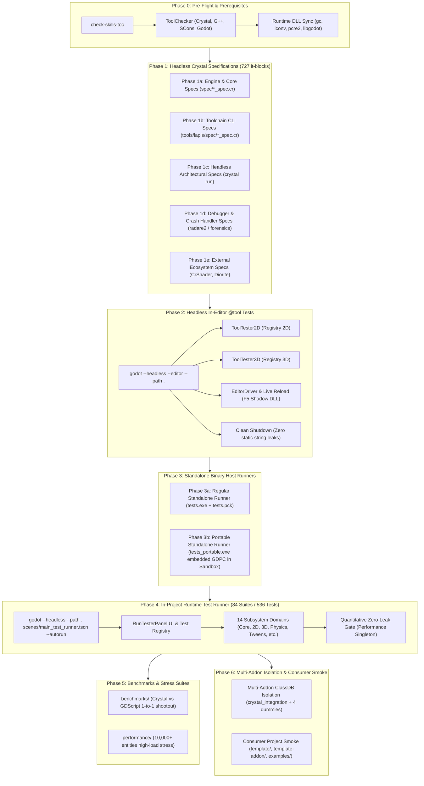

# Comprehensive Lapis Multi-Tier Test Matrix & Phase Guide

This document provides an exhaustive, authoritative catalogue of all **1,260+ asserted test blocks**, **84 modular runtime test suites**, **70 engine and architectural specs**, **19 CLI toolchain specs**, **3 external ecosystem specs**, **2 in-editor `@tool` runners**, **2 standalone binary host runners**, and comparative performance benchmarks in the **Lapis for Crystal** engine.

---

## 1. High-Level Testing Pipeline & Phase Architecture

Lapis operates a **6-Phase Verification Pipeline** that spans compile-time macro expansion, headless compiler unit specs, in-editor `@tool` lifecycle execution, standalone native binary embedding, and full in-engine scene graph runtime execution with quantitative zero-leak verification.



---

## 2. Test Execution Phases: In-Depth Breakdown

<table>
  <thead>
    <tr>
      <th align="center">Phase</th>
      <th align="left">Name / Scope</th>
      <th align="left">Host Binary & Mode</th>
      <th align="left">Execution Command</th>
      <th align="left">Pass/Fail Signal & Artifacts</th>
    </tr>
  </thead>
  <tbody>
    <tr>
      <td align="center"><strong>Phase 0</strong></td>
      <td><strong>Pre-Flight & Prerequisite Audit</strong></td>
      <td>Crystal runner / OS shell</td>
      <td><code>crystal run tools/update_skill_tocs.cr -- --check</code><br/><code>lapis deps && lapis sync</code></td>
      <td>Exit code 0; synced DLLs in <code>bin/</code>, <code>template/bin/</code>, <code>examples/*/bin/</code></td>
    </tr>
    <tr>
      <td align="center"><strong>Phase 1a</strong></td>
      <td><strong>Engine & Core Bindings Specs</strong></td>
      <td><code>crystal spec</code> (Headless)</td>
      <td><code>crystal spec spec/*_spec.cr</code></td>
      <td><code>bin/junit_engine_specs/output.xml</code></td>
    </tr>
    <tr>
      <td align="center"><strong>Phase 1b</strong></td>
      <td><strong>Lapis Toolchain & CLI Specs</strong></td>
      <td><code>crystal spec</code> (Headless)</td>
      <td><code>crystal spec tools/lapis/spec</code></td>
      <td><code>bin/junit_cli_specs/output.xml</code></td>
    </tr>
    <tr>
      <td align="center"><strong>Phase 1c</strong></td>
      <td><strong>Headless Architectural Specs</strong></td>
      <td><code>crystal run</code> (Headless)</td>
      <td><code>crystal run spec/libgodot_spec.cr ...</code> (15 scripts)</td>
      <td>Process exit code 0 per script</td>
    </tr>
    <tr>
      <td align="center"><strong>Phase 1d</strong></td>
      <td><strong>Debugger & Crash Handler Specs</strong></td>
      <td><code>crystal spec</code> (Headless)</td>
      <td><code>crystal spec spec/crash_handler_spec.cr spec/radare_driver_spec.cr ...</code></td>
      <td><code>bin/junit_debugger_specs/output.xml</code></td>
    </tr>
    <tr>
      <td align="center"><strong>Phase 1e</strong></td>
      <td><strong>External Ecosystem Specs (Informational)</strong></td>
      <td><code>crystal spec</code> (Headless)</td>
      <td><code>crystal spec spec/external/*_spec.cr</code></td>
      <td>Checklist completion; non-blocking informational flag</td>
    </tr>
    <tr>
      <td align="center"><strong>Phase 2</strong></td>
      <td><strong>Headless In-Editor <code>@tool</code> Tests</strong></td>
      <td><code>godot.exe --editor --headless</code></td>
      <td><code>godot.exe --headless --rendering-driver opengl3 --audio-driver Dummy --editor --path . --quit-after 10000</code></td>
      <td><code>.tool_tests_passed</code>, <code>junit_tool_2d.xml</code>, <code>junit_tool_3d.xml</code></td>
    </tr>
    <tr>
      <td align="center"><strong>Phase 3a</strong></td>
      <td><strong>Regular Standalone Runner</strong></td>
      <td><code>bin/tests.exe</code> (LibGodot Standalone Host)</td>
      <td><code>tests.exe --headless --rendering-driver opengl3 --audio-driver Dummy --quit-after 600 -- --autorun</code></td>
      <td><code>bin/.runtime_tests_passed</code>, <code>bin/.runtime_test_results.txt</code></td>
    </tr>
    <tr>
      <td align="center"><strong>Phase 3b</strong></td>
      <td><strong>Portable Standalone Runner</strong></td>
      <td><code>tests_portable.exe</code> (Embedded GDPC PCK)</td>
      <td><code>tests_portable.exe --headless --rendering-driver opengl3 --audio-driver Dummy --quit-after 600 -- --autorun</code> (in isolated sandbox)</td>
      <td><code>scratch/test_portable_sandbox/.runtime_tests_passed</code></td>
    </tr>
    <tr>
      <td align="center"><strong>Phase 4</strong></td>
      <td><strong>In-Project Runtime Test Runner</strong></td>
      <td><code>godot.exe --headless</code> (GDExtension Host)</td>
      <td><code>godot.exe --headless --rendering-driver opengl3 --audio-driver Dummy --path . --quit-after 600 -- --autorun</code></td>
      <td><code>.runtime_tests_passed</code>, <code>junit.xml</code>, <code>bin/test_report.json</code>, <code>bin/test_report.md</code></td>
    </tr>
    <tr>
      <td align="center"><strong>Phase 5</strong></td>
      <td><strong>Benchmarks & Stress Suites</strong></td>
      <td><code>make benchmarks-run</code> / <code>make perf_run</code></td>
      <td><code>make -C benchmarks run ITERATIONS=3</code><br/><code>make -C performance run</code></td>
      <td>Comparative ANSI/SVG charts, frame rate / allocation ratios</td>
    </tr>
    <tr>
      <td align="center"><strong>Phase 6</strong></td>
      <td><strong>Addon Isolation & Consumer Smoke</strong></td>
      <td><code>godot.exe</code> on consumer directories</td>
      <td><code>powershell -File scripts/verify_editor.ps1 -Path template -QuitAfter 50</code><br/><code>godot.exe --headless --path template --quit-after 50</code></td>
      <td>Zero <code>Unreferenced static string</code> errors; clean exit 0</td>
    </tr>
  </tbody>
</table>

---

## 3. Phase 1: Crystal Unit & Architectural Specifications Breakdown

Phase 1 runs purely in the Crystal runtime without opening a full Godot window, validating binding mechanics, code generation, GC behavior, and CLI operations.

### Phase 1a: Engine & Core Language Specifications (`spec/`)
70 files, 498 asserted `it` blocks.

<table>
  <thead>
    <tr>
      <th align="left">Specification File</th>
      <th align="center">Tests</th>
      <th align="left">What It Does & What It Tests</th>
    </tr>
  </thead>
  <tbody>
    <tr>
      <td><code>spec/core_spec.cr</code></td>
      <td align="center">12</td>
      <td>Validates core Variant conversions, StringName allocations, ClassDB lookup, and basic Godot object instantiation.</td>
    </tr>
    <tr>
      <td><code>spec/math_spec.cr</code></td>
      <td align="center">28</td>
      <td>Exhaustively tests Godot math primitives: <code>Vector2</code>, <code>Vector2i</code>, <code>Vector3</code>, <code>Vector3i</code>, <code>Vector4</code>, <code>Transform2D</code>, <code>Transform3D</code>, <code>Basis</code>, <code>Quaternion</code>, <code>Color</code>, <code>AABB</code>, <code>Rect2</code>.</td>
    </tr>
    <tr>
      <td><code>spec/features_spec.cr</code></td>
      <td align="center">18</td>
      <td>Tests DSL syntax: <code>node</code>, <code>@[Export]</code>, custom property getters/setters, default values, signal registrations, and method routing.</td>
    </tr>
    <tr>
      <td><code>spec/safety_spec.cr</code></td>
      <td align="center">8</td>
      <td>Tests dead pointer detection, defensive <code>#check_alive!</code> invocations, and verifies that accessing destroyed objects raises <code>Godot::DisposedObjectError</code>.</td>
    </tr>
    <tr>
      <td><code>spec/safety_and_bindings_spec.cr</code></td>
      <td align="center">15</td>
      <td>Validates Boehm GC object retention across heap sweeps, dynamic property scaling (registering 220+ properties on a single node), 10+ signal argument packing, and deep Variant round-trips.</td>
    </tr>
    <tr>
      <td><code>spec/match_spec.cr</code></td>
      <td align="center">14</td>
      <td>Tests pattern matching DSL (<code>match</code> macro) over Variant values, polymorphic class downcasting, primitive extraction, and guard conditions.</td>
    </tr>
    <tr>
      <td><code>spec/scene_pipeline_spec.cr</code></td>
      <td align="center">16</td>
      <td>Tests typed scene instantiation via <code>"res://..." &gt; NodeClass</code>, fluent <code>.configure { ... }</code>, and parent-child chaining via <code>&gt;</code>.</td>
    </tr>
    <tr>
      <td><code>spec/signal_operators_spec.cr</code></td>
      <td align="center">22</td>
      <td>Tests first-class signal operators: <code>+=</code> (connect), <code>-=</code> (disconnect), <code>&gt;&gt;</code> (pipeline forwarding), <code>&gt;</code> (fire-and-forget emit), and automatic listener lifetime pruning.</td>
    </tr>
    <tr>
      <td><code>spec/concurrency_spec.cr</code></td>
      <td align="center">11</td>
      <td>Tests cooperative Crystal fibers (<code>Godot.spawn</code>), cooperative yielding via <code>Fiber.yield</code>, non-blocking channel handoffs, and mutex lock contention.</td>
    </tr>
    <tr>
      <td><code>spec/thread_safety_spec.cr</code></td>
      <td align="center">14</td>
      <td>Validates <code>Godot::ThreadSafety</code> assertions, detecting when background OS threads attempt illegal SceneTree mutations, raising <code>Godot::ThreadAffinityError</code>.</td>
    </tr>
    <tr>
      <td><code>spec/timer_handle_spec.cr</code></td>
      <td align="center">10</td>
      <td>Tests <code>Godot::TimerHandle</code>: non-blocking timer ticks, interval stepping, pause, resume, and cancellation mechanics.</td>
    </tr>
    <tr>
      <td><code>spec/script_language_spec.cr</code></td>
      <td align="center">16</td>
      <td>Tests <code>Lapis::CrystalValidator</code>, verifying that syntax errors in <code>.cr</code> files are parsed into Godot Script diagnostics with exact line/column offsets.</td>
    </tr>
    <tr>
      <td><code>spec/lsp_spec.cr</code></td>
      <td align="center">9</td>
      <td>Validates Crystalline Language Server hooks, completion providers, hover documentation harvesting, and definition resolution for the Lapis DSL.</td>
    </tr>
    <tr>
      <td><code>spec/editor_driver_spec.cr</code></td>
      <td align="center">6</td>
      <td>Validates <code>Lapis::Test::EditorDriver</code> orchestration, resolving Godot executable paths, launching headless editor sessions, and asserting exit codes.</td>
    </tr>
    <tr>
      <td><code>spec/editor_reload_spec.cr</code></td>
      <td align="center">5</td>
      <td>Simulates the Windows shadow DLL reloading cycle: compiling a modified DLL, swapping pointers in the bridge, and verifying live class re-registration.</td>
    </tr>
    <tr>
      <td><code>spec/editor_reload_state_preserver_spec.cr</code></td>
      <td align="center">8</td>
      <td>Verifies that exported inspector property values and node transforms are preserved across live GDExtension DLL reloads.</td>
    </tr>
    <tr>
      <td><code>spec/testing_spec.cr</code></td>
      <td align="center">24</td>
      <td>Tests the <code>Lapis::Test</code> assertion apparatus itself: comparisons, collection matchers, exception traps, and JUnit XML generation.</td>
    </tr>
    <tr>
      <td><code>spec/suites_registry_spec.cr</code></td>
      <td align="center">2</td>
      <td>Meta-spec that reflects over <code>Lapis::Test::Registry</code> to assert that all 84 test suites are loaded and have valid source locations.</td>
    </tr>
  </tbody>
</table>

---

### Phase 1b: Lapis Toolchain & CLI Specifications (`tools/lapis/spec/`)
19 files, 217 asserted `it` blocks.

<table>
  <thead>
    <tr>
      <th align="left">CLI Spec File</th>
      <th align="center">Tests</th>
      <th align="left">What It Does & What It Tests</th>
    </tr>
  </thead>
  <tbody>
    <tr>
      <td><code>tools/lapis/spec/cli_spec.cr</code></td>
      <td align="center">15</td>
      <td>Tests core CLI entry point, argument parsing, `--help`, `--version`, flag normalization, and exit codes.</td>
    </tr>
    <tr>
      <td><code>tools/lapis/spec/commands_spec.cr</code></td>
      <td align="center">22</td>
      <td>Tests subcommand routing: <code>build</code>, <code>run</code>, <code>editor</code>, <code>test</code>, <code>bind</code>, <code>clean</code>, <code>sync</code>, <code>package</code>, <code>doctor</code>.</td>
    </tr>
    <tr>
      <td><code>tools/lapis/spec/standalone_spec.cr</code></td>
      <td align="center">14</td>
      <td>Tests standalone game compilation: compiling <code>bin/game.exe</code>, linking CRT, copying runtime DLLs, and creating <code>game.pck</code>.</td>
    </tr>
    <tr>
      <td><code>tools/lapis/spec/export_templates_spec.cr</code></td>
      <td align="center">12</td>
      <td>Tests automated Godot export template downloading, caching in user directory, integrity checksum verification, and ZIP extraction.</td>
    </tr>
    <tr>
      <td><code>tools/lapis/spec/install_addon_spec.cr</code></td>
      <td align="center">16</td>
      <td>Tests addon installation: cloning Git repositories, copying directory structures, resolving <code>plugin.cfg</code>, and updating <code>project.godot</code>.</td>
    </tr>
    <tr>
      <td><code>tools/lapis/spec/shard_manager_spec.cr</code></td>
      <td align="center">11</td>
      <td>Tests automated <code>shard.yml</code> manipulation, updating dependency versions, resolving local path overrides, and running <code>shards install</code>.</td>
    </tr>
    <tr>
      <td><code>tools/lapis/spec/template_store_spec.cr</code></td>
      <td align="center">10</td>
      <td>Tests the local template cache: squirreling custom game templates, listing registered templates, and scaffolding new projects from templates.</td>
    </tr>
    <tr>
      <td><code>tools/lapis/spec/tui_spec.cr</code></td>
      <td align="center">18</td>
      <td>Tests the interactive ANSI TUI engine: double-buffer terminal rendering, phase progress tracking, ANSI striping, and window resizing.</td>
    </tr>
    <tr>
      <td><code>tools/lapis/spec/tui_views_spec.cr</code></td>
      <td align="center">14</td>
      <td>Tests TUI split-pane layouts, rolling log view buffers, status icons, keyboard navigation (<code>↑</code>/<code>↓</code>/<code>Enter</code>), and modal overlays.</td>
    </tr>
    <tr>
      <td><code>tools/lapis/spec/analyze_spec.cr</code></td>
      <td align="center">12</td>
      <td>Tests <code>lapis analyze</code>: invoking radare2 to audit binary sections, detect unsafe symbols, verify DEP/ASLR, and enforce binary size budgets.</td>
    </tr>
    <tr>
      <td><code>tools/lapis/spec/upgrade_spec.cr</code></td>
      <td align="center">13</td>
      <td>Tests <code>lapis upgrade</code>: checking GitHub releases for Godot, Radare2, and Lapis, downloading archives, and performing in-place binary upgrades.</td>
    </tr>
  </tbody>
</table>

---

## 4. Phase 2: Headless In-Editor `@tool` Tests Breakdown

Phase 2 launches the genuine Godot Editor binary headlessly (`--headless --editor --path . --quit-after 10000`) with environment flags `CRYSTAL_TOOL_TEST=1` and `GODOT_RUN_TOOL_TESTS=1`.

### In-Editor Components & Invariants:
1. **`ToolTester2D` (`src/main.cr:17-80`)**:
   - An active `@tool` class derived from `Godot::Node2D`.
   - Exposes in-editor buttons via `@[ExportToolButton("▶ Run 2D Tool Tests")]`.
   - Automatically executes all 2D tests in the editor environment.
   - Verifies 2D transform calculations, CanvasItem rendering coordinates, and scene tree parenting in the live editor viewport.
2. **`ToolTester3D` (`src/main.cr:82-144`)**:
   - An active `@tool` class derived from `Godot::Node3D`.
   - Exposes in-editor buttons via `@[ExportToolButton("▶ Run 3D Tool Tests")]`.
   - Automatically executes all 3D tests in the editor environment.
   - Verifies 3D transforms, MeshInstance3D generation, DirectionalLight3D properties, and Camera3D projections.
3. **Editor Clean Shutdown Protocol (`scripts/verify_editor.ps1`)**:
   - Verifies that `ResourceFormatLoaderCrystal` recognizes `.cr` files as native `Script` resources.
   - Asserts that upon closing the editor, **zero** `ERROR: BUG: Unreferenced static string to 0: ...` errors are emitted, proving zero memory leaks of StringNames or ClassDB entries.

---

## 5. Phase 3: Standalone Host Binary Runners Breakdown

Phase 3 validates the **Standalone Host Execution Paradigm** (Mode B), where the Crystal runtime boots first, loads Godot as an embedded library (`libgodot.dll` / `libgodot.so`), and executes tests without relying on an external `godot.exe` binary.

### Subphase 3a: Regular Standalone Test Runner
- **Executable**: `bin/tests.exe` (or `bin/game.exe`)
- **Resource Package**: `bin/tests.pck` (or `bin/game.pck`)
- **Execution Mode**: `tests.exe --headless --rendering-driver opengl3 --audio-driver Dummy --quit-after 600 -- --autorun`
- **What It Tests**:
  - Validates that Godot's C-API boots cleanly when embedded inside a native Crystal executable.
  - Verifies that the native Crystal Boehm GC and Godot's memory allocators co-exist without colliding.
  - Verifies command-line argument passing from the OS through Crystal's CRT into Godot's `Main::setup`.

### Subphase 3b: Portable Standalone Runner in Isolated Sandbox
- **Executable**: `bin/tests_portable.exe`
- **Embedded Architecture**: The complete `tests.pck` resource package is appended directly into the binary file itself using Godot's GDPC footer structure.
- **Sandbox Test Execution**:
  1. Creates an isolated temporary directory: `scratch/test_portable_sandbox/`.
  2. Copies only `tests_portable.exe` and runtime DLLs (`gc.dll`, `libgodot.dll`, `crystal_bridge.dll`) into the sandbox.
  3. **Deliberately omits any `.pck` file on disk.**
  4. Runs `tests_portable.exe --headless --rendering-driver opengl3 --audio-driver Dummy --quit-after 600 -- --autorun`.
- **What It Tests**:
  - Proves that self-contained single-executable deployments function with 100% autonomy in zero-dependency environments.
  - Asserts that Godot's internal PCK loader correctly detects the embedded GDPC header/footer and mounts the internal virtual filesystem `res://`.

---

## 6. Phase 4: In-Project Runtime Test Runner (All 84 Suites Breakdown)

Phase 4 executes `scenes/main_test_runner.tscn` in Godot, invoking `RunTesterPanel` to run all **84 modular suites** registered in `Lapis::Test::Registry`.

<table>
  <thead>
    <tr>
      <th>Subsystem</th>
      <th>Suites Count</th>
      <th>Representative Suites</th>
      <th>Scope & Invariants Tested</th>
    </tr>
  </thead>
  <tbody>
    <tr>
      <td><strong>1. Core & Built-ins</strong></td>
      <td>7 suites</td>
      <td><code>test_core_builtins.cr</code>, <code>test_2d_nodes.cr</code>, <code>test_3d_nodes.cr</code>, <code>test_control_nodes.cr</code>, <code>test_scale_stress.cr</code></td>
      <td>Vector2/3/4 math, transforms, Node2D/3D hierarchies, GUI containers, 5,000-node stress allocation.</td>
    </tr>
    <tr>
      <td><strong>2. Graphics & Shaders</strong></td>
      <td>5 suites</td>
      <td><code>test_meshes_materials.cr</code>, <code>test_shaders_compilation.cr</code>, <code>test_geometry_surfacetool.cr</code></td>
      <td>Procedural SurfaceTool meshes, custom GLSL shader compilation, materials, Viewport textures.</td>
    </tr>
    <tr>
      <td><strong>3. Physics & Collision</strong></td>
      <td>6 suites</td>
      <td><code>test_physics_multiframe_pit_settling.cr</code>, <code>test_physics_cube_stack_stability.cr</code>, <code>test_physics_raycast_builder.cr</code></td>
      <td>200-ball falling pit settling over 60 frames, 10-tier cube stack stability, fluent raycasting DSL.</td>
    </tr>
    <tr>
      <td><strong>4. Audio & Tweens</strong></td>
      <td>4 suites</td>
      <td><code>test_audio_animation.cr</code>, <code>test_tween_dsl.cr</code>, <code>test_tweens_animation.cr</code></td>
      <td>16-pillar fluent tween stepping DSL, AudioServer bus routing, AnimationPlayer keyframing.</td>
    </tr>
    <tr>
      <td><strong>5. Resources & Scenes</strong></td>
      <td>5 suites</td>
      <td><code>test_resources_utilities.cr</code>, <code>test_scenes_persistence.cr</code>, <code>test_resource_card_lifecycle.cr</code></td>
      <td>PackedScene serialization, custom Resource cards, ConfigFile encryption, reference counting.</td>
    </tr>
    <tr>
      <td><strong>6. Memory & Safety</strong></td>
      <td>5 suites</td>
      <td><code>test_dead_pointer_safety.cr</code>, <code>test_lifecycle_destruction.cr</code>, <code>test_destruction_and_threads_multiframe.cr</code></td>
      <td>Multi-wrapper aliasing dead-pointer traps, queue_free vs destroy, 50-node multi-frame cascade.</td>
    </tr>
    <tr>
      <td><strong>7. Concurrency & Fibers</strong></td>
      <td>6 suites</td>
      <td><code>test_concurrency.cr</code>, <code>test_concurrency_actor_channel.cr</code>, <code>test_thread_safety_enforcement.cr</code></td>
      <td>Cooperative fibers yielding across frames, Actor Pattern worker channels, thread affinity gates.</td>
    </tr>
    <tr>
      <td><strong>8. Signals & Events</strong></td>
      <td>5 suites</td>
      <td><code>test_callable_signals_advanced.cr</code>, <code>test_signal_safety_multiframe.cr</code>, <code>test_signal_bus_advanced.cr</code></td>
      <td>Custom Callables, dead listener auto-pruning, global decoupled signal buses, priority propagation.</td>
    </tr>
    <tr>
      <td><strong>9. ClassDB & Reflection</strong></td>
      <td>6 suites</td>
      <td><code>test_classdb_coverage.cr</code>, <code>test_macros_dsl.cr</code>, <code>test_dsl_edge_cases_and_leaks.cr</code></td>
      <td>ClassDB method table reflection, AST macro expansion, onready? lazy binding, dynamic properties.</td>
    </tr>
    <tr>
      <td><strong>10. GDScript Interop</strong></td>
      <td>4 suites</td>
      <td><code>test_gdscript_channel_signal_interop.cr</code>, <code>test_gdscript_inheritance_polymorphism.cr</code></td>
      <td>GDScript signals unboxing to Crystal channels, GDScript classes inheriting from Crystal nodes.</td>
    </tr>
    <tr>
      <td><strong>11. Toolchain & Addons</strong></td>
      <td>10 suites</td>
      <td><code>test_multi_addon_isolation.cr</code>, <code>test_editor_plugins_comprehensive.cr</code>, <code>test_script_first_class.cr</code></td>
      <td>5-addon ClassDB conflict isolation, EditorPlugin dock lifecycle, CrystalScript engine resource.</td>
    </tr>
    <tr>
      <td><strong>12. Deep Bindings & Servers</strong></td>
      <td>5 suites</td>
      <td><code>test_packed_arrays_containers.cr</code>, <code>test_variant_math_deep.cr</code>, <code>test_servers_low_level_rid.cr</code></td>
      <td>Contiguous PackedArrays, 38-variant math operators, low-level RenderingServer RID handles.</td>
    </tr>
    <tr>
      <td><strong>13. Procedural & Navigation</strong></td>
      <td>3 suites</td>
      <td><code>test_noise_procedural_generation.cr</code>, <code>test_astar_navigation.cr</code>, <code>test_image_pixel_buffer.cr</code></td>
      <td>FastNoiseLite fractal octaves, AStar2D/3D weighted pathfinding, raw RGBA8 image pixel buffers.</td>
    </tr>
    <tr>
      <td><strong>14. Gameplay & Architecture</strong></td>
      <td>13 suites</td>
      <td><code>test_fsm_dsl.cr</code>, <code>test_hsm_pushdown_automata.cr</code>, <code>test_node_pool_stress.cr</code>, <code>test_combat_scenario.cr</code></td>
      <td>Hierarchical State Machines, zero-allocation 1,000-bullet pooling, real-time combat simulation.</td>
    </tr>
  </tbody>
</table>

---

## 7. Quantitative Zero-Leak Verification Mechanics

A signature invariant of Lapis is **Quantitative Zero-Leak Verification**. In tests that allocate and destroy entities, memory safety is mathematically proven using Godot's internal engine performance monitors:

```crystal
def assert_no_leak(max_delta_objects : Int32 = 0, name : String = "Operation", &block)
  # 1. Warmup and flush Boehm GC & Godot MessageQueue
  5.times { Fiber.yield }
  GC.collect

  # 2. Record initial baseline monitors from Godot engine
  perf = Godot.performance
  initial_objects = perf.get_monitor(Godot::Performance::Monitor::ObjectCount).to_i64
  initial_nodes   = perf.get_monitor(Godot::Performance::Monitor::ObjectNodeCount).to_i64
  initial_static  = perf.get_monitor(Godot::Performance::Monitor::MemoryStatic).to_i64

  # 3. Execute the test payload
  yield

  # 4. Flush deferred deallocations and garbage sweep
  5.times { Fiber.yield }
  GC.collect

  # 5. Measure final metrics and assert zero delta
  final_objects = perf.get_monitor(Godot::Performance::Monitor::ObjectCount).to_i64
  final_nodes   = perf.get_monitor(Godot::Performance::Monitor::ObjectNodeCount).to_i64

  delta_objects = (final_objects - initial_objects).abs
  delta_nodes   = (final_nodes - initial_nodes).abs

  assert_lte delta_objects, max_delta_objects, "#{name}: Object leak detected! Baseline: #{initial_objects}, Final: #{final_objects}"
  assert_eq delta_nodes, 0, "#{name}: Node leak detected! Baseline: #{initial_nodes}, Final: #{final_nodes}"
end
```

---

## 8. Verification & Execution Reference

```powershell
# Run the full automated multi-phase test suite (Specs -> Tool Tests -> Standalone -> Runtime)
make test

# Or via the Lapis CLI directly:
bin/lapis test

# Or run with the interactive Terminal User Interface (TUI) dashboard:
bin/lapis test --tui

# Run only Crystal unit specs (Phases 1a & 1b):
make spec

# Run only in-editor tool tests (Phase 2):
crystal spec spec/editor_driver_spec.cr

# Run runtime tests with a specific category filter (e.g. Concurrency or Physics):
bin/lapis test -c "Concurrency"
bin/lapis test -c "Physics"
```
